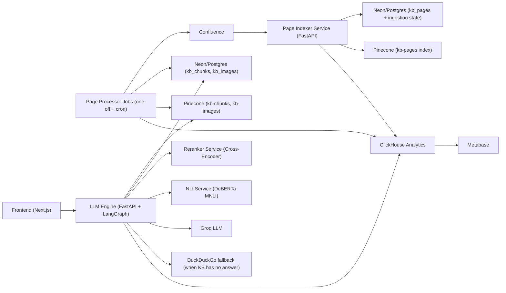

# Nucleus AI

Production-style, multi-service AI knowledge system for enterprise docs.

This project ingests Confluence pages, processes text/tables/images, indexes them into vector + relational stores, and serves grounded answers through a retrieval-rerank-validate pipeline with full stage-level observability.

## Why This Is Worth Looking At

- Designed as a real system, not a notebook demo: independent services, async jobs, retries, and analytics.
- Retrieval quality is explicit: hybrid recall + cross-encoder reranking + NLI contradiction checks.
- Data freshness is explicit: page stashing, one-off indexing, and cron-style delta processing.
- Operability is explicit: ClickHouse pipeline telemetry + Metabase dashboards.

## System Architecture



## Query Pipeline (Online Path)

`frontend -> llm-engine /query -> intent routing -> retrieval -> reranking -> generation -> validation`

1. Intent router classifies query as `knowledge` vs `general`.
2. Retrieval fuses chunk-level and page-level semantic search from Pinecone.
3. Candidate chunks are reranked by local cross-encoder (`ms-marco-MiniLM-L-6-v2`).
4. LLM generates only from provided context.
5. NLI service scores contradiction between context and answer.
6. Guardrails enforce output constraints; response returns answer + sources + related images.

## Ingestion & Processing (Offline Path)

1. `page-indexer` receives page IDs and initializes ingestion state.
2. Metadata lands in Neon (`kb_pages`) and Pinecone (`kb-pages`).
3. `page-processor` fetches page HTML, extracts text/tables/images, builds semantic chunks.
4. Chunks/images are upserted into Neon + Pinecone.
5. Cron job computes deltas by hash and deactivates stale chunks/images (`is_active = false`).
6. Retry job replays failed stages and marks fatal rows when recovery fails.

## Tech Stack

- Backend: FastAPI, LangGraph, Python
- LLM/AI: Groq (OpenAI-compatible), CrossEncoder reranker, DeBERTa NLI, Guardrails
- Vector DB: Pinecone (`kb-pages`, `kb-chunks`, `kb-images`)
- Relational DB: Neon/Postgres
- Analytics: ClickHouse + Metabase
- Frontend: Next.js (App Router), TypeScript, Tailwind
- Infra: Docker Compose, Make

## Repo Structure

```text
services/
  page_indexer/       # metadata ingestion + retry endpoints
  llm_engine/         # LangGraph RAG runtime
  reranker_service/   # cross-encoder scoring API
  nli_service/        # contradiction scoring API
jobs/
  page_indexer_trigger/   # bulk page ID trigger
  indexer_retry/          # failed stage reprocessing
  page_processor/
    jobs/one_off/         # initial full processing
    jobs/cron/            # incremental delta processing
frontend/                 # chat UI + API proxy
clickhouse/init/          # analytics schema
```

## Local Run

### 1) Configure environment

Create `.env` with keys used by services:

- `CONFLUENCE_API_TOKEN`
- `CONFLUENCE_AUTH_USER`
- `CONFLUENCE_SPACE_KEY`
- `CONFLUENCE_BASE_URL`
- `CONFLUENCE_ANCESTOR_ID` (optional)
- `NEON_DB_URL`
- `PINECONE_API_KEY`
- `GROQ_API_KEY`
- `GROQ_MODEL`
- `LANGCHAIN_TRACING_V2`
- `LANGCHAIN_API_KEY`
- `LANGCHAIN_PROJECT`
- `PROMPTLAYER_API_KEY`
- `GOOGLE_API_KEY`
- `HUGGING_FACE_API_KEY`

Also provide Guardrails token via `.secrets/guardrails_token`.

### 2) Start stack

```bash
make up
```

### 3) Trigger ingestion/processing jobs

```bash
make indexer-trigger
make processor-oneoff
make indexer-retry
```

### 4) Access services

- Frontend: `http://localhost:3001`
- LLM Engine: `http://localhost:8200`
- Reranker: `http://localhost:8090`
- NLI: `http://localhost:8080`
- Page Indexer: `http://localhost:8000`
- Metabase: `http://localhost:3000`

## What This Demonstrates About My Engineering

- I design end-to-end systems with clear service boundaries and failure recovery.
- I balance model quality with runtime pragmatism (hybrid retrieval + rerank + validation).
- I build for operations from day one (stage metrics, pipeline metrics, dashboard-ready schema).
- I optimize for product reality: evolving docs, stale data handling, and trustworthy answers.
