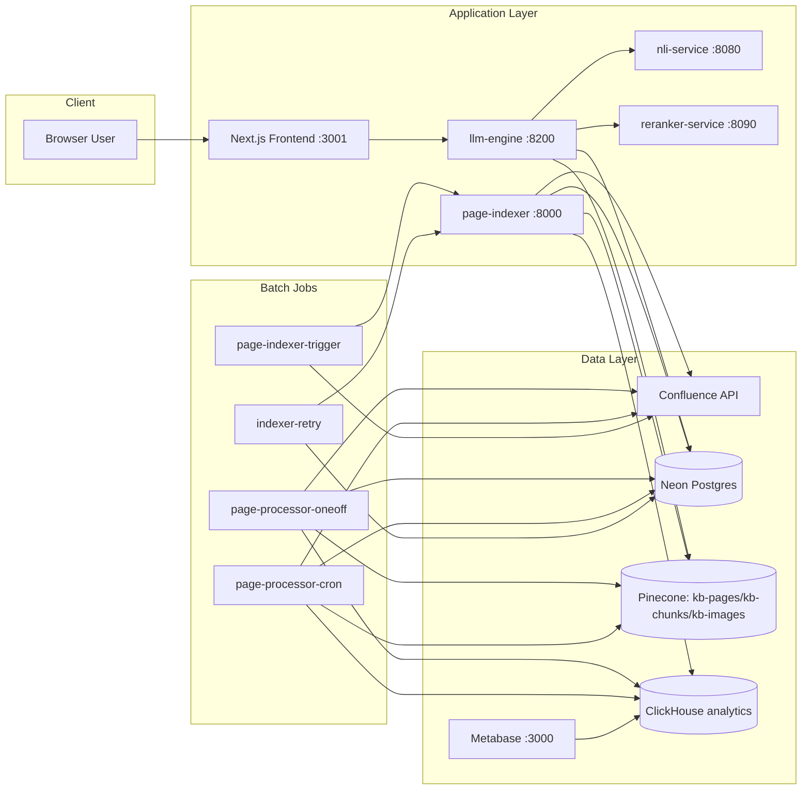
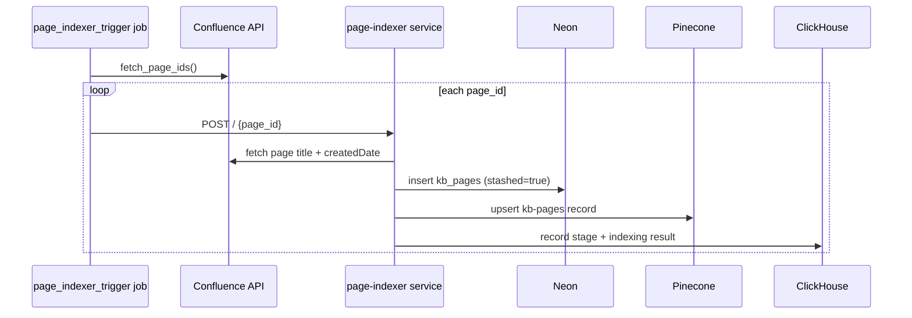
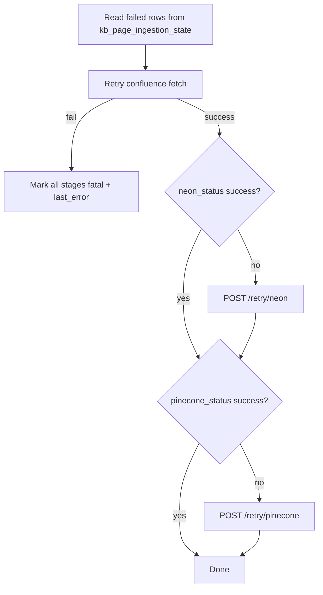
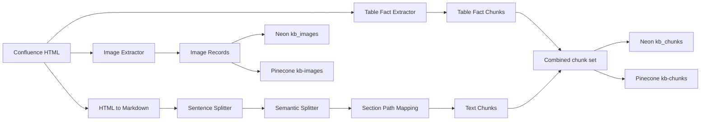
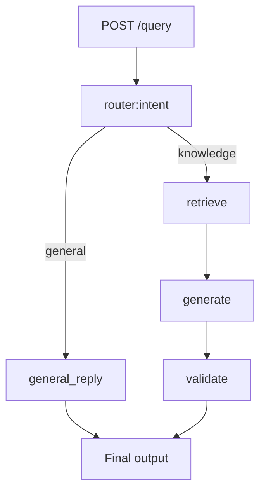
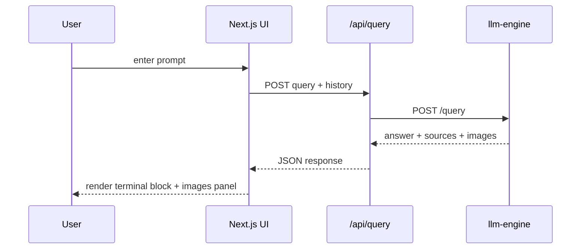
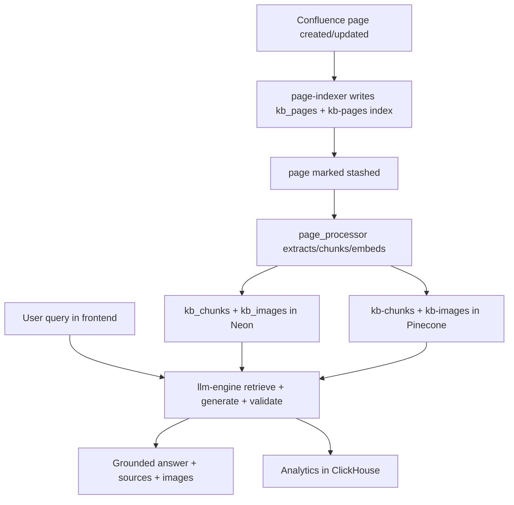

# Nucleus-AI System Design Document

## 1) Executive Summary

Nucleus-AI is a multi-service Retrieval-Augmented Generation (RAG) platform centered on Confluence ingestion, vector + relational indexing, and a chat experience that answers internal knowledge questions with source grounding.

At a high level, the platform is split into:

- **Ingestion and indexing plane**: discovers Confluence pages, stores metadata, and prepares retryable indexing state.
- **Content processing plane**: extracts text/tables/images, chunks content, computes embeddings, and stores artifacts in Neon + Pinecone.
- **Query and reasoning plane**: runs an intent-routed LangGraph workflow to retrieve evidence, generate answers, validate with NLI, and optionally fall back to web search.
- **Presentation plane**: a Next.js frontend with conversational history and image-side panel.
- **Observability plane**: stage and pipeline metrics stored in ClickHouse and visualized with Metabase.

---

## 2) Repository Capability Index ("what exists")

### Core runtime services

- `services/page_indexer`: FastAPI service that handles page-created/update/delete/restore events and writes initial page metadata/state to Neon and Pinecone.
- `services/llm_engine`: FastAPI + LangGraph RAG orchestrator for query answering.
- `services/nli_service`: local MNLI model inference endpoint for contradiction scoring.
- `services/reranker_service`: cross-encoder reranking service.

### Batch/trigger jobs

- `jobs/page_indexer_trigger`: enumerates Confluence page IDs and posts each to page indexer.
- `jobs/indexer_retry`: scans failed ingestion states and retries stage-by-stage.
- `jobs/page_processor/jobs/one_off`: full initial processing over discovered pages.
- `jobs/page_processor/jobs/cron`: incremental processing for stashed pages.

### Shared libraries

- `common/utils.py`: env, Neon DB connection, Pinecone client.
- `common/analytics.py`: ClickHouse insert helpers for stage/page/query analytics.
- `jobs/page_processor/helpers/*`: extraction, hashing, storage upserts, embedding wrappers.

### Product/UI

- `frontend/`: Next.js app with `/api/query` proxy and terminal-style chat UX.

### Infrastructure

- `docker-compose.yml`: all services + ClickHouse + Metabase + frontend.
- `clickhouse/init/logs.sql`: analytics schema bootstrap.

---

## 3) Deployment & Runtime Topology

---

## 4) Data Model & Storage Responsibilities

## 4.1 Relational (Neon)

Primary conceptual entities:

- **`kb_pages`**: page metadata (`page_id`, title, source URL, created timestamp, stashed state).
- **`kb_chunks`**: chunk corpus keyed by deterministic `chunk_hash`, with `section_path`, `page_id`, `is_active`.
- **`kb_images`**: image corpus keyed by deterministic `image_hash`, with caption/url/page mapping and active flags.
- **`kb_page_ingestion_state`**: per-page stage statuses for confluence/neon/pinecone + retry lifecycle.

## 4.2 Vector (Pinecone)

Indexes used:

- `kb-pages` for page metadata/title retrieval.
- `kb-chunks` for content semantic retrieval.
- `kb-images` for image-caption semantic retrieval.

Record IDs are content hashes for chunks/images and `page:{page_id}` for pages.

## 4.3 Analytics (ClickHouse)

Metrics tables (insert-only from codepaths):

- `stage_execution`
- `indexing_page_result`
- `processing_page_result`
- `query_result`

These provide stage-level latency/status and end-to-end result monitoring.

---

## 5) Ingestion Pipeline Workflows

## 5.1 Index trigger workflow (page metadata bootstrap)

### Notes
- Page indexer initializes retry state in `kb_page_ingestion_state`.
- Operations are fault-tolerant through retry-enabled HTTP clients and stage retries.

## 5.2 Retry workflow

---

## 6) Content Processing Pipeline (Chunking + Embeddings)

The page processor has two entrypoints:

- **one_off**: initial/explicit backfill over fetched page IDs.
- **cron**: incremental processing over `kb_pages.is_stashed = TRUE`.

Processing stages per page:

1. Fetch page storage HTML from Confluence.
2. Extract images + structured table facts.
3. Convert HTML→Markdown (tables/images removed for text path).
4. Create structural chunks (`SentenceSplitter`), then semantic splits (`SemanticSplitterNodeParser`) using local HF embedder.
5. Infer section paths from DOM heading ancestry.
6. Upsert chunks/images into Neon and Pinecone.
7. For cron mode: deactivate removed chunks/images and add only deltas.
8. Mark page unstashed if all sink steps succeed.
9. Emit processing analytics.

---

## 7) Query/RAG Pipeline Design

The `llm_engine` compiles a LangGraph state machine with explicit nodes:

- `router` (intent classification: `knowledge` vs `general`)
- `general_reply` (friendly non-RAG response)
- `retrieve` (Pinecone retrieval + Neon fetch + reranking + context build)
- `generate` (LLM generation + image retrieval + optional web fallback)
- `validate` (NLI contradiction check + output-length guard + final response)

### Retrieval mechanics
- Vector search on `kb-chunks` using query text.
- Candidate chunk fetch from Neon for full text/metadata.
- Cross-encoder reranking via local reranker service.
- Threshold filtering before context assembly.

### Validation mechanics
- NLI service scores contradiction between context (premise) and answer (hypothesis).
- High contradiction blocks answer with a safe failure message.
- Guardrails length validator enforces practical response size.

### Fallback behavior
If model returns “not found in knowledge base”, the engine performs DuckDuckGo web search and summarizes findings while labeling them as external.

---

## 8) Frontend Interaction & UX Workflow

Frontend behavior:

- Uses `/api/query` route as server-side proxy to `llm-engine`.
- Maintains multi-turn history and sends prior turns for context.
- Stores non-loading chat blocks in `localStorage`.
- Displays markdown answers, source snippets, and separate image panel.

---

## 9) Reliability, Error Handling, and Retry Strategy

Cross-cutting reliability patterns:

- HTTP clients with retry adapters (`429/5xx` backoff).
- Stage-level “safe record” analytics writes wrapped to avoid cascading failures.
- Multi-attempt sink writes in processors.
- Retry job to recover partial indexing failures.
- Fallback responses in query path when dependencies are unavailable.

Current notable operational caveats observed from implementation:

- Broad `except Exception` patterns suppress detailed error diagnostics across many services.
- Some endpoints return `None` on failure (can produce ambiguous HTTP behavior).
- In `page_processor` cron mode, `upsert_neon_images(...)` is called with an unexpected extra positional argument, which likely causes image-step failure and continuous retries.

---

## 10) Security & Configuration Surface

Primary env-driven integration keys/URLs:

- Confluence: base URL, auth user, API token, optional ancestor/space filters.
- Neon: `NEON_DB_URL`.
- Pinecone: `PINECONE_API_KEY`.
- LLM: `GROQ_API_KEY`, `GROQ_MODEL`.
- Service-to-service: `NLI_URL`, `RERANKER_URL`, `PAGE_INDEXER_URL`.

Operational guidance:

- Secrets should be supplied via `.env` and Docker secret mount (`guardrails_token`).
- Least-privilege DB and API tokens recommended.

---

## 11) End-to-End Lifecycle (from Confluence to Answer)

---

## 12) System Boundaries and Ownership Suggestions

Suggested ownership boundaries (for scaling engineering teams):

- **Ingestion team**: page-indexer + trigger/retry jobs.
- **Knowledge processing team**: page_processor + extractors + embedding strategy.
- **AI runtime team**: llm_engine + NLI/reranker orchestration + safety controls.
- **Product team**: frontend interaction and UX.
- **Platform team**: Docker topology, ClickHouse/Metabase observability.

This split mirrors existing service seams and minimizes coupling.

---

## 13) Suggested Next Design Improvements

1. Introduce typed error envelopes and structured logs (trace_id across all calls).
2. Replace broad `except` with classified exceptions + metrics dimensions.
3. Add schema migrations and explicit DB DDL docs for Neon tables.
4. Add health/readiness probes for all services and model warmup checks.
5. Add integration tests for pipeline contracts (indexing state, retry, rag flow).
6. Fix cron processor neon image call signature mismatch and add regression test.
7. Add message queue/event bus for decoupled ingestion and processing throughput control.
